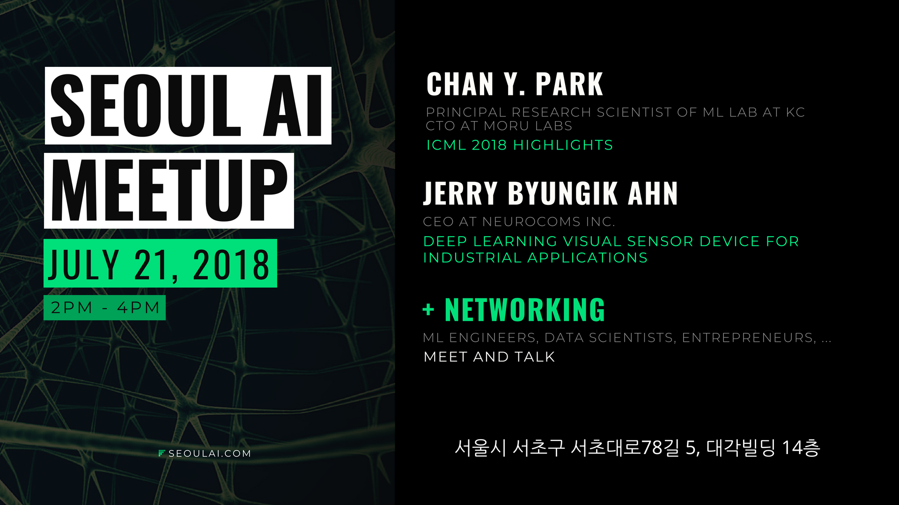
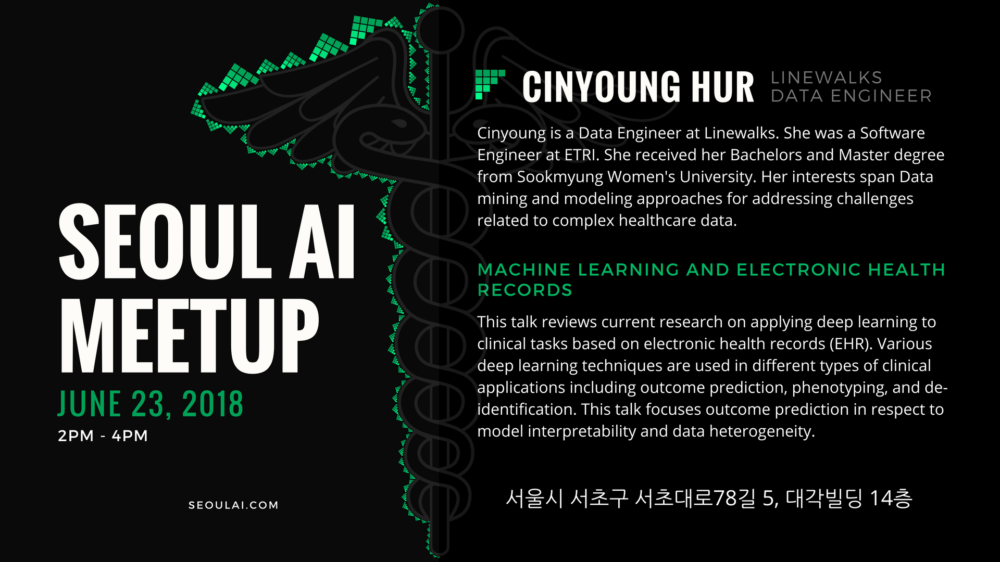
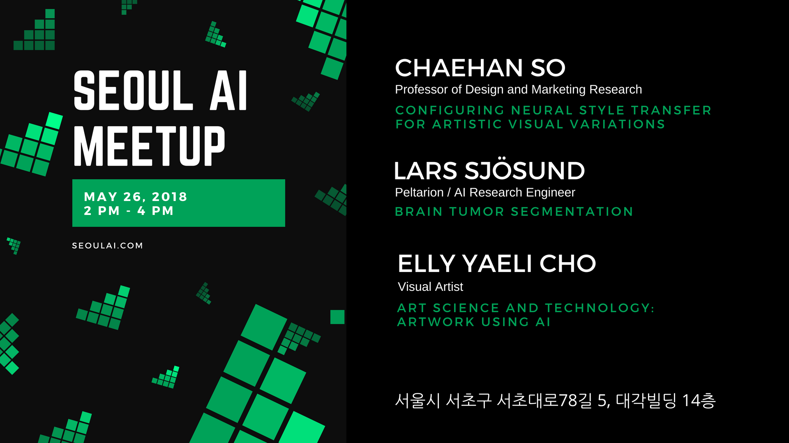

If you want to collaborate with us, register at [seoulai.herokuapp.com](https://seoulai.herokuapp.com/) and join our slack at [seoulai.slack.com](https://seoulai.slack.com/). If you want to give a talk [fill in this form](https://bit.ly/seoulai-talk-proposal). To receive (by email) the latest information about upcoming meetups, hackathons and other events organized by Seoul AI, [subscribe through this form](subscribe).




 
## Previous Meetups

### September 1, 2018
* Topological Data Analysis to understand Convolutional Neural Networks (Aleksei Prokopev, [presentation](presentations/Topological_Data_Analysis_to_understand_Convolutional_Neural_Networks.pdf))
* Seoul AI Gym ([Martin](members/martin), [presentation](presentations/Seoul_AI_Gym_Checkers.pdf))
* Spaced Repetition Systems: How to Remember Everything! ([Raj](members/raj), [presentation](presentations/Spaced_Repetition_Systems.pdf))

<iframe src="https://www.facebook.com/plugins/video.php?href=https%3A%2F%2Fwww.facebook.com%2Fseoulai%2Fvideos%2F1112650105559055%2F&show_text=0&width=560" width="560" height="315" style="border:none;overflow:hidden" scrolling="no" frameborder="0" allowTransparency="true" allowFullScreen="true"></iframe>

### July 21, 2018
* ICML 2018 Highlights (Chan Y. Park (박찬연), [presentation](presentations/ICML_2018_Highlights.pdf))
* Deep Learning Visual Sensor Device for Industrial Applications (Jerry Byungik Ahn, [presentation](presentations/Deep_Learning_Visual_Sensor_for_Industrial_Applications.pdf))

<iframe src="https://www.facebook.com/plugins/video.php?href=https%3A%2F%2Fwww.facebook.com%2Fseoulai%2Fvideos%2F240792686739125%2F&show_text=0&width=560" width="560" height="315" style="border:none;overflow:hidden" scrolling="no" frameborder="0" allowTransparency="true" allowFullScreen="true"></iframe>

### July 7, 2018
* Introduction to uTensor ([Neil Tan](https://www.linkedin.com/in/neil-tan), [presentation](presentations/uTensor_Intro.pdf))
* CapsuleNets - Dynamic Routing between capsules (Dmitriy Khvan, [presentation](presentations/CapsuleNets.pdf))
* Cryptocurrency Trading Project Proposal (James Park, [presentation](presentations/Cryptocurrency_Trading_Project_Proposal.pdf))
* Patient Representation with Electronic Health Records - Demo ([Cinyoung Hur](members/cinyoung), [presentation](presentations/Patient_Representation_Demo.pdf))

<iframe src="https://www.facebook.com/plugins/video.php?href=https%3A%2F%2Fwww.facebook.com%2Fseoulai%2Fvideos%2F226670068151387%2F&show_text=0&width=560" width="560" height="315" style="border:none;overflow:hidden" scrolling="no" frameborder="0" allowTransparency="true" allowFullScreen="true"></iframe>

### June 23, 2018
* Deep Learning and Electronic Health records ([Cinyoung Hur](members/cinyoung), [presentation](presentations/Machine_Learning_and_Electronic_Health_Records.pdf), [awesome-ehr-deeplearning](https://github.com/hurcy/awesome-ehr-deeplearning))

### June 9, 2018
* Object detection transfer learning tool (Sulki Kim, [presentation](presentations/Transfer_learning_Active_learning_using_tensorflow_object_detection_api.pdf))
* Dimensionality Reduction with t-SNE ([Zaur Fataliyev](https://www.linkedin.com/in/fvzaur), [presentation](presentations/t-SNE.pdf))
* Seoul AI Gym ([Martin](members/martin), [presentation](presentations/Seoul_AI_Gym.pdf))

### May 26, 2018
* Configuring neural style transfer for artistic visual variations ([소재한, Chaehan So](https://kr.linkedin.com/in/chaehan-so-087261), [paper](https://arxiv.org/abs/1805.10852))
* Brain Tumor Segmentation ([Lars Sjösund](https://www.linkedin.com/in/lars-lowe-sj%C3%B6sund-22429560/), [presentation](https://www.slideshare.net/LarsLoweSjsund/brain-tumor-segmentation-seoul-ai-20180526-100235776), [demo](https://colab.research.google.com/drive/1RkvieIa5Z46fKIJqLeyGvLrSDlt0LwLJ))
* Art Science and technology; Artwork using AI ([Elly Yaeli Cho](http://www.ellycho.net/), [presentation](presentations/mediart_ai_small.pdf))

<iframe src="https://www.facebook.com/plugins/video.php?href=https%3A%2F%2Fwww.facebook.com%2Fseoulai%2Fvideos%2F192983174853410%2F&show_text=0&width=560" width="560" height="315" style="border:none;overflow:hidden" scrolling="no" frameborder="0" allowTransparency="true" allowFullScreen="true"></iframe>

<iframe src="https://www.facebook.com/plugins/video.php?href=https%3A%2F%2Fwww.facebook.com%2Fseoulai%2Fvideos%2F193009404850787%2F&show_text=0&width=560" width="560" height="315" style="border:none;overflow:hidden" scrolling="no" frameborder="0" allowTransparency="true" allowFullScreen="true"></iframe>

<iframe src="https://www.facebook.com/plugins/video.php?href=https%3A%2F%2Fwww.facebook.com%2Fseoulai%2Fvideos%2F193032794848448%2F&show_text=0&width=560" width="560" height="315" style="border:none;overflow:hidden" scrolling="no" frameborder="0" allowTransparency="true" allowFullScreen="true"></iframe>

### May 12, 2018
Seoul AI Hackathon ([info](presentations/3rd_Seoul_AI_Hackathon_info.pdf), [project presentations](presentations/3rd_Seoul_AI_Hackathon.pdf))

### April 28, 2018
* Name Entity Recognition for Medicines ([Cinyoung](members/cinyoung), [presentation](presentations/Name_Entity_Recognition_for_Medicines.pdf))
* A Toy Model for Homomorphic Encryption for Linear Regression ([Adel](members/adel), [presentation](presentations/A_Toy_Model_for_Homomorphic_Encryption_for_Linear_Regression.pdf), [Jupyter Notebook](https://github.com/adelshb/Toy-Model-for-Homomorphic-Encryption-for-Linear-Regression/blob/master/Homomorphic_Encryption_for_Lieanr_Regression.ipynb))
* uTensor / Tensorflow on Mbed Microcontrollers ([Emilio](members/emilio), [presentation](presentations/uTensor.pdf))

### April 14, 2018
* Unfoncerence
* Celebrating 1 year anniversary of Seoul AI

### March 31, 2018
* MAML and Reptile ([Martin](members/martin), [presentation](presentations/MAML_and_Reptile.pdf))
* Homomorphic Voting Schemes ([Raj](members/raj), [presentation](presentations/Homomorphic_Voting_Scheme.pdf))
* Data Selfie ([Emilio](members/emilio), [presentation](presentations/Data_Selfie.pdf))

### March 17, 2018
* Kx, kdb+ and q – An introduction (Kate, [presentation](presentations/kx.pdf))
* Introduction to Topological Data Analysis (Aleksei, [presentation](presentations/Introduction_to_Topological_Data_Analysis.pdf))
* Smart Contracts and Scalability ([Raj](members/raj), [presentation](presentations/Smart_Contracts_and_Scalability.pdf))

### March 3, 2018
* Spatial Bloom Filters and Privacy Preservation with Homomorphic Encryption ([Raj](members/raj), [presentation](presentations/Spatial_Bloom_Filters.pdf))
* Mobile AI ([Emilio](members/emilio), [presentation](presentations/Mobile_AI.pdf))
* Speed it up with ... Python? ([Martin](members/martin), [presentation](presentations/Speed_it_up_with_..._Python.pdf))

### February 17, 2018
* Velocity Obstacles: Autonomous Navigation on 2D Environments ([Vincent](members/vincent), [presentation](presentations/Autonomous_Navigation_2D_Environments.pdf))
* Homomorphic Encryption and Applications for Machine Learning and Other Areas ([Raj](members/raj), [presentation](presentations/Homomorphic_Encryption.pdf))

### February 3, 2018
* Feature Preprocessing and Generation with Respect to Models - part 2 ([Cinyoung](members/cinyoung), [presentation](presentations/Preprocessing_Tips_part2.pdf))
* Get started with NLP (Aleksei, [presentation](https://docs.google.com/presentation/d/e/2PACX-1vSVEFuHzJQK1bKkXAIyom69NtHAnUrQObkVSTgLYlSnyC1568iO2RfZu5f0wrfmczkLcKvdd-saaKw1/pub?start=false&loop=false&delayms=3000#slide=id.p))
* Popularity prediction based on Twitter log (Changsik, [presentation](presentations/celebrity_popularity_prediction.pdf))

### January 20, 2018
Mini AI Hackathon ([project presentations](presentations/mini-ai-hackathon-20180120.pdf))

### January 8, 2018
* Running Tensorflow on AWS Sagemaker (Sun Keun Choi, [presentation](presentations/Introduction_to_Amazon_Sagemaker.pdf))
* CNN visualizations ([Martin](members/martin), [presentation](presentations/CNN_Visualizations.pdf), [github](https://github.com/martinkersner/cnn-visualizations))
* Feature Preprocessing and Generation with Respect to Models ([Cinyoung](members/cinyoung), [presentation](presentations/Preprocessing_Tips.pdf))

### [Presentations from 2017](2017)

